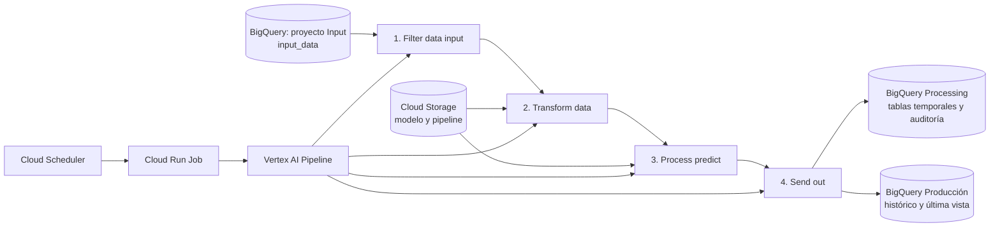

# Pipeline de predicción de viviendas en Google Cloud

## 1. Resumen

Este proyecto implementa un proceso de inferencia de Machine Learning en Google Cloud para procesar registros de viviendas, transformar sus variables, aplicar un modelo previamente entrenado y publicar los resultados en BigQuery.

La solución está separada en tres proyectos de Google Cloud para diferenciar la fuente de datos, el procesamiento y el consumo de resultados. La ejecución se automatiza con Cloud Scheduler, Cloud Run Jobs y Vertex AI Pipelines.

## 2. Arquitectura

Los diagramas editables que acompañan esta documentación son:

- [Diagrama de arquitectura y flujo de datos](Diagrama_Proyecto.drawio): representa los tres proyectos, los recursos de GCP, las tablas intermedias, los artefactos y la secuencia Scheduler → Cloud Run → Vertex AI.
- [Diagrama de cuentas de servicio y permisos](Diagrama_GSA.drawio): representa las identidades de ejecución y las relaciones de acceso entre Cloud Scheduler, Cloud Run, Vertex AI, BigQuery y Cloud Storage.

> Para editar o visualizar los diagramas, abrir los archivos `.drawio` con [diagrams.net](https://app.diagrams.net/).

### Proyectos involucrados

| Capa | Proyecto | Responsabilidad |
|---|---|---|
| Input | `gcp-data-bigquery-prod-us-east` | Almacena la tabla fuente `hist_table.input_data`. |
| Processing | `gcp-processing-vertex-prod-us` | Ejecuta Cloud Run, Vertex AI Pipelines, BigQuery temporal y Cloud Storage. |
| Output | `gcp-output-bigquery-prod-us-ea` | Publica las tablas de consumo final. |

## 3. Recursos implementados

### BigQuery

| Ubicación | Dataset / tabla | Uso |
|---|---|---|
| Input | `hist_table.input_data` | Datos fuente filtrados por `periodo`. |
| Processing | `dev_table.features_input` | Catálogo y orden de variables que ingresan al modelo. |
| Processing | `dev_table.temp_data_input` | Datos filtrados para la ejecución. |
| Processing | `dev_table.temp_data_transformed` | Variables transformadas y escaladas. |
| Processing | `dev_table.temp_data_predict` | Resultado intermedio de la predicción. |
| Processing | `dev_table.model_execution_audit` | Auditoría de ejecución, modelo y ruta utilizada. |
| Output | `prod_table.ba_aux_modelo_universo` | Última vista disponible del universo procesado. |
| Output | `prod_table.ba_modelo_propension_inscripcion` | Histórico de resultados y predicciones. |

### Cloud Storage

El bucket `gcp-processing-storage-prod` contiene el modelo, el pipeline compilado y los artefactos requeridos por la ejecución. Las rutas principales se agrupan bajo `project-pipeline-predictions-casas/`.

### Cloud Run y Vertex AI

- **Cloud Run Job:** `run-pipeline-casas-job` inicia una ejecución de Vertex AI.
- **Vertex AI Pipeline:** ejecuta cuatro componentes secuenciales: filtrado, transformación, predicción y publicación.
- **Cloud Scheduler:** programa y lanza el Cloud Run Job sin intervención manual.
- **Parámetros:** el Job acepta `--periodo` en formato `AAAAMM`. Si se omite o recibe `AUTO`, la aplicación consulta `MAX(periodo)` en la tabla de entrada.

## 4. Flujo de procesamiento

1. Cloud Scheduler invoca el Cloud Run Job con la cuenta de servicio configurada.
2. Cloud Run resuelve el período solicitado y genera un `run_id` para trazabilidad.
3. Vertex ejecuta `FILTER DATA INPUT`, que lee la tabla de entrada y selecciona las variables requeridas.
4. `TRANSFORM DATA` carga el artefacto de transformación y aplica imputación, codificación, transformaciones numéricas y escalamiento.
5. `PROCESS PREDICT` descarga el modelo `.joblib`, genera la predicción y registra información de auditoría.
6. `SEND OUT` publica el resultado en las tablas del proyecto de salida: una histórica y una de última vista.
7. El resultado queda disponible para análisis en BigQuery.

## 5. Transformación y modelo

El modelo se carga desde Cloud Storage como artefacto `.joblib`. La preparación de datos utiliza un pipeline de transformación entrenado previamente, asegurando que las variables de inferencia tengan el mismo tratamiento y orden que los datos de entrenamiento.

Las tablas intermedias conservan las variables necesarias para auditoría y permiten revisar cada etapa del proceso sin modificar los datos fuente.

## 6. Seguridad e IAM

La solución usa cuentas de servicio separadas por responsabilidad y aplica acceso entre proyectos.

| Cuenta de servicio | Función principal |
|---|---|
| `sa-scheduler-scheduler-prod-01@...` | Ejecuta o invoca el Cloud Run Job desde Cloud Scheduler. |
| `sa-crun-crun-prod-01@...` | Ejecuta el contenedor de Cloud Run y envía el Pipeline Job. |
| `sa-processing-crun-vertex-prod@...` | Ejecuta los componentes del pipeline de Vertex AI. |
| `sa-admin-storage-prod-01@...` | Administración de objetos de Cloud Storage. |
| `sa-data-adm-bigquery-prod-01@...` | Administración de recursos de BigQuery. |

Permisos relevantes definidos en los archivos `permissions.md`:

| Recurso | Permiso mínimo aplicado / requerido | Motivo |
|---|---|---|
| Proyecto Processing | BigQuery Job User | Crear consultas y trabajos de BigQuery. |
| Tabla fuente de Input | BigQuery Data Viewer | Leer los datos de entrada. |
| Tablas temporales de Processing | BigQuery Data Editor | Crear, actualizar y consultar tablas intermedias. |
| Tablas de Output | BigQuery Data Viewer y Data Editor | Consultar y publicar los resultados finales. |
| Bucket de Cloud Storage | Storage Object Viewer / Object User | Leer modelo, pipeline y artefactos. |
| Vertex AI | Vertex AI User | Ejecutar componentes del pipeline. |
| Cuentas de servicio | Service Account User | Permitir que Cloud Run envíe el pipeline usando la cuenta de Vertex. |

> La cuenta adjunta a cada recurso usa sus propios permisos durante la ejecución. El permiso **Service Account User** permite usar una cuenta de servicio en un recurso, pero no hereda automáticamente los permisos de BigQuery o Storage de otra cuenta.

El detalle visual de estas relaciones está disponible en el [Diagrama de cuentas de servicio y permisos](Diagrama_GSA.drawio).

## 7. Evidencias de la implementación

### 7.1 Ejecución programada

Cloud Scheduler registra una ejecución sin errores del Job programado.

El Job de Cloud Run fue invocado y finalizó correctamente.

### 7.2 Ejecución del pipeline de Vertex AI

La ejecución de Vertex AI fue iniciada desde Cloud Run.

El grafo de ejecución muestra todos los componentes completados correctamente: filtrado, transformación, predicción, publicación y notificación.

### 7.3 Permisos y cuentas de servicio

Configuración IAM del proyecto de procesamiento.

Relación de acceso de la cuenta de Cloud Run hacia la cuenta de ejecución de Vertex AI.

Relación de acceso de Scheduler hacia la cuenta utilizada por Cloud Run.

### 7.4 Tablas intermedias y transformación

El dataset de Processing contiene la tabla de variables de entrada, las tres tablas temporales y la tabla de auditoría del modelo.

La tabla `temp_data_transformed` evidencia las variables procesadas y escaladas antes de la predicción.

### 7.5 Acceso a la fuente de datos

La cuenta de servicio de Vertex cuenta con acceso para ejecutar trabajos de BigQuery en el proyecto Input.

La tabla fuente contiene el campo `periodo` y los atributos de viviendas que alimentan el pipeline.

### 7.6 Publicación de resultados

El proyecto Output contiene las dos tablas de destino: última vista e histórico.

La tabla auxiliar conserva la última vista del universo procesado.

La tabla histórica almacena las ejecuciones publicadas por período.

La configuración IAM del proyecto Output permite administrar las tablas de publicación.

### 7.7 Almacenamiento de artefactos

El bucket del proyecto Processing centraliza modelos y especificaciones del pipeline.

## 8. Resultado

La solución opera de forma automatizada: toma el período solicitado —o el más reciente disponible—, procesa los datos de entrada, aplica el pipeline de transformación y el modelo de Machine Learning, y publica los resultados en BigQuery. La evidencia adjunta confirma la ejecución correcta de Cloud Scheduler, Cloud Run Job y los componentes del pipeline de Vertex AI.

## 9. Repositorios y archivos de referencia

- [Diagrama de arquitectura y flujo de datos](Diagrama_Proyecto.drawio)
- [Diagrama de cuentas de servicio y permisos](Diagrama_GSA.drawio)
- [Configuración del proyecto Input](project-data-input/Dev-Project.md)
- [Permisos del proyecto Input](project-data-input/permissions.md)
- [Configuración del proyecto Processing](project-data-processing/Dev.Project.md)
- [Permisos del proyecto Processing](project-data-processing/permissions.md)
- [Configuración del proyecto Output](project-data-prod/Dev.Project.md)
- [Permisos del proyecto Output](project-data-prod/permissions.md)
- [Aplicación de Cloud Run](service/crun/main.py)
- [Definición del pipeline compilado](project-data-processing/pipeline-processing-predict.json)
